# SOC Threat Hunting & Detection Engineering Lab


## Project Outcomes

- Successfully ingested and analyzed over 50,000+ events in Splunk
- Detected encoded PowerShell execution and SSH brute force attempts
- Implemented automated blocking using Fail2Ban
- Built end-to-end SOC workflow from detection to response

----

A hands-on cybersecurity project demonstrating end-to-end Security Operations Center (SOC) capabilities, including threat detection, investigation, automated response, and performance metrics using Splunk, Sysmon, and Fail2Ban.

---

## Key Highlights

- Built detection engineering use cases using Splunk SIEM
- Simulated real-world attack scenarios (PowerShell, SSH brute force)
- Implemented automated defense using Fail2Ban
- Mapped detections to MITRE ATT&CK framework
- Developed SOC metrics for performance evaluation
- Created investigation workflows and dashboards

---

## Technologies Used

- Splunk SIEM
- Sysmon (Windows telemetry)
- Ubuntu Linux (log monitoring)
- Fail2Ban (automated response)
- VirtualBox (lab environment)

----

## Executive Summary

This project demonstrates a Threat Hunting Lab built using Splunk SIEM,
where proactive hunting techniques are used to identify suspicious activity
without relying on predefined alerts.

The lab focuses on hypothesis-driven investigations using endpoint telemetry
(Sysmon) and log analysis aligned with MITRE ATT&CK.

Key achievements:

- Conducted proactive threat hunting using Splunk SPL
- Identified suspicious PowerShell activity
- Investigated process relationships and anomalies
- Mapped findings to MITRE ATT&CK techniques
- Built hunting queries for SOC analysts


------------------------------------------------------------------------

# 1. Project Overview

Unlike traditional detection labs, this project focuses on proactive threat discovery.

This project simulates a real-world SOC threat hunting environment where
security analysts proactively search for malicious activity using Splunk SIEM,
without relying solely on predefined alerts.

Objectives:

-   Understand threat hunting methodology
-   Perform hypothesis-driven investigations
-   Analyze endpoint telemetry using Sysmon logs
-   Identify suspicious process behavior
-   Detect PowerShell-based attacks and obfuscation techniques
-   Investigate parent-child process relationships
-   Map findings to MITRE ATT&CK framework
-   Differentiate between normal and anomalous system behavior

Focus areas:

-  Threat Hunting
-  Endpoint Telemetry Analysis
-  Behavioral Analysis
-  Splunk SPL Query Development
-  MITRE ATT&CK Mapping
-  SOC Investigation Workflow


------------------------------------------------------------------------

# 2. Lab Architecture

The Threat Hunting Lab consists of multiple virtual machines designed to simulate a real-world SOC environment for proactive threat analysis.

- **Windows 10 Endpoint:** Generates telemetry using Sysmon (process creation, command execution, parent-child relationships).

- **Ubuntu Splunk Server:** Acts as Splunk **Indexer + Search Head** for log ingestion, search, and threat hunting.

- **Linux System Logs:** Provides authentication telemetry (SSH activity).

- **Kali Linux (Optional):** Used to simulate attacker behavior and generate suspicious activity.

## Architecture Diagram

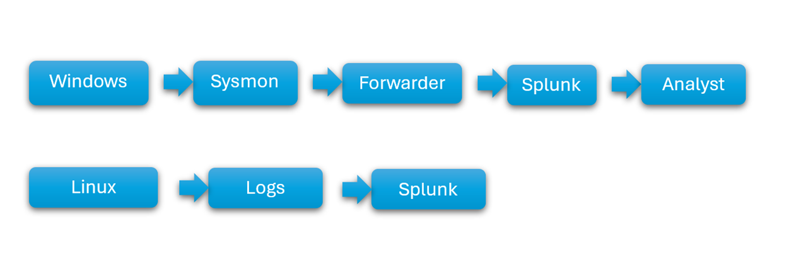

## Data Flow

Windows Endpoint → Sysmon Logs → Splunk Universal Forwarder → Splunk Indexer → Threat Hunting Analysis

Linux System → auth.log → Splunk → Threat Hunting Analysis

## Threat Hunting Perspective

Unlike detection-based SOC workflows, this lab focuses on analyzing raw telemetry to identify anomalies and suspicious behaviors without relying on predefined alerts.

SOC analysts use Splunk SPL queries to explore data, identify patterns, and investigate potential threats.

------------------------------------------------------------------------

# 3. Telemetry Sources

The Threat Hunting Lab relies on multiple telemetry sources to analyze system behavior and identify suspicious activity.

## Windows Security Logs

EventID 4624 --- Successful Logon  
EventID 4625 --- Failed Logon  

## Sysmon Logs

EventID 1 --- Process Creation  
EventID 3 --- Network Connection  
EventID 10 --- Process Access (Credential Access Detection)  
EventID 11 --- File Creation  

## Linux Logs

/var/log/auth.log --- SSH authentication activity  

## Endpoint Telemetry (Key Focus)

- Process execution details (Image, CommandLine)
- Parent-child process relationships
- User context and privilege level
- File creation activity
- Network connections

## Threat Hunting Relevance

These telemetry sources enable SOC analysts to:

- Identify abnormal process behavior  
- Detect suspicious PowerShell activity  
- Investigate credential access attempts  
- Analyze attacker techniques without predefined alerts  

These telemetry sources provide deep visibility into endpoint activity, enabling proactive threat hunting and behavioral analysis.

------------------------------------------------------------------------

# 4. Tools & Environment

The Threat Hunting Lab was built using the following tools and technologies:

- **SIEM:** Splunk Enterprise (Ubuntu)

- **Endpoint Monitoring:** Microsoft Sysmon

- **Log Forwarding:** Splunk Universal Forwarder

- **Virtualization:** Oracle VM VirtualBox

- **Operating Systems:**
  - Windows 10 (Endpoint telemetry generation)
  - Ubuntu Server (Splunk SIEM)
  - Kali Linux (Attack simulation - optional)

- **Attack Simulation Tools:**
  - PowerShell
  - Command Prompt (cmd.exe)

## Threat Hunting Capability

These tools enable:

- Centralized log collection and analysis  
- Real-time and historical data exploration  
- Endpoint visibility through Sysmon telemetry  
- Investigation using Splunk SPL queries  

------------------------------------------------------------------------

# 5. Repository Structure

The project repository is organized to clearly separate architecture, detections, threat hunting queries, and supporting documentation.

- architecture
- detections
- sigma-rules
- screenshots
- queries (Splunk detection & hunting queries)
- README.md


------------------------------------------------------------------------

# 6. Environment Setup

The Threat Hunting Lab environment was built using virtual machines to simulate a real-world SOC setup.

## Virtual Machines

**Windows 10 Endpoint**  
RAM: 4GB  
Disk: 60GB  

**Ubuntu Splunk Server**  
RAM: 2GB  
Disk: 30GB  

**Kali Linux (Optional)**  
RAM: 2GB  
Disk: 30GB  

## Network Setup

Adapter 1 --- NAT (internet access)  
Adapter 2 --- Host-Only Network (internal lab communication)  

## Configuration Overview

- Sysmon installed on Windows endpoint for telemetry collection  
- Splunk Universal Forwarder configured to send logs to Splunk server  
- Splunk Enterprise configured as Indexer and Search Head  
- Linux logs enabled for authentication monitoring  

## Threat Hunting Readiness

The environment was configured to generate and centralize telemetry, enabling analysts to perform proactive threat hunting using Splunk SPL queries.

------------------------------------------------------------------------

# 7. Log Collection Pipeline

The Threat Hunting Lab collects and centralizes logs from multiple systems into Splunk for analysis.

## Windows Logs Forwarded

- Security Logs  
- System Logs  
- Sysmon Operational Logs  

## Linux Logs Forwarded

- /var/log/auth.log  
- /var/log/syslog  

## Splunk Index

```
index=main
```
**Screenshot**


## Log Collection Pipeline Flow

Windows Endpoint → Sysmon → Splunk Universal Forwarder → Splunk Indexer → Threat Hunting Analysis  

Linux System → auth.log → Splunk → Threat Hunting Analysis  

## Verification of Log Ingestion

To verify that telemetry is successfully ingested into Splunk, the following query was used:

**Splunk Query**
```
index=main source="WinEventLog:Microsoft-Windows-Sysmon/Operational"
| head 20
```
**Explanation**

This query retrieves recent Sysmon events indexed in Splunk, confirming that the Splunk Universal Forwarder on the Windows endpoint is successfully sending security telemetry to the Splunk server.

**Evidence**


This step ensures data availability for threat hunting and confirms the integrity of the telemetry pipeline.

------------------------------------------------------------------------

# 8. Threat Hunting Strategy

The Threat Hunting Lab follows a hypothesis-driven approach to proactively identify suspicious activity within the environment.

Unlike traditional detection-based SOC operations, threat hunting focuses on exploring telemetry to uncover hidden threats that may not trigger predefined alerts.


## Hunting Methodology

The following methodology was used:

1. Formulate hypotheses based on attacker behavior  
2. Analyze endpoint telemetry using Splunk SPL  
3. Identify anomalies and suspicious patterns  
4. Investigate process execution and relationships  
5. Map findings to MITRE ATT&CK techniques  

## Note:
All detections in this project use manual field extraction (rex) from raw Sysmon logs to ensure consistency and reliability across environments where field parsing may not be pre-configured.

## Hunting Hypotheses

### Hypothesis 1: PowerShell may be used for malicious execution

Attackers commonly use PowerShell for execution, obfuscation, and lateral movement.

### Hypothesis 2: Encoded commands may indicate obfuscation

Encoded PowerShell commands are often used to evade detection mechanisms.

### Hypothesis 3: Parent-child process relationships may reveal anomalies

Unusual parent-child relationships (e.g., PowerShell spawning unexpected processes) may indicate malicious activity.

### Hypothesis 4: Credential access attempts may target LSASS

Processes attempting to access LSASS memory may indicate credential dumping activity.

## Threat Hunting Objective

The goal of this approach is to identify suspicious behaviors, investigate anomalies, and uncover potential threats before they trigger security alerts.

This approach enables proactive threat discovery and enhances the overall security posture of the environment.

------------------------------------------------------------------------

# 9. Attack Simulations

To support threat hunting activities, lightweight attack simulations were performed to generate relevant telemetry within the lab environment.

These simulations focus on common attacker techniques such as PowerShell execution, command obfuscation, and process spawning.

---

### Simulation 1 — PowerShell Execution

**Command**
```
powershell Get-Process
```

**Purpose**

Generate normal PowerShell activity to establish a baseline for comparison.

---

### Simulation 2 — Encoded PowerShell Command

**Command**
```
powershell -EncodedCommand UwB0AGEAcgB0AC0AUAByAG8AYwBlAHMAcwAgAGMAYQBsAGMALgBlAHgAZQA=
```

**Purpose**

Simulate obfuscated command execution commonly used by attackers.

---

### Simulation 3 — Suspicious Process Execution

**Command**
```
powershell Start-Process calc.exe
```


**Purpose**

Simulate suspicious parent-child process behavior (PowerShell spawning another process).

---

## Threat Hunting Relevance

These simulations generate telemetry that allows analysts to:

- Identify abnormal PowerShell activity  
- Detect encoded or obfuscated commands  
- Analyze parent-child process relationships  
- Perform hypothesis-driven threat hunting  

## Simulation Evidence

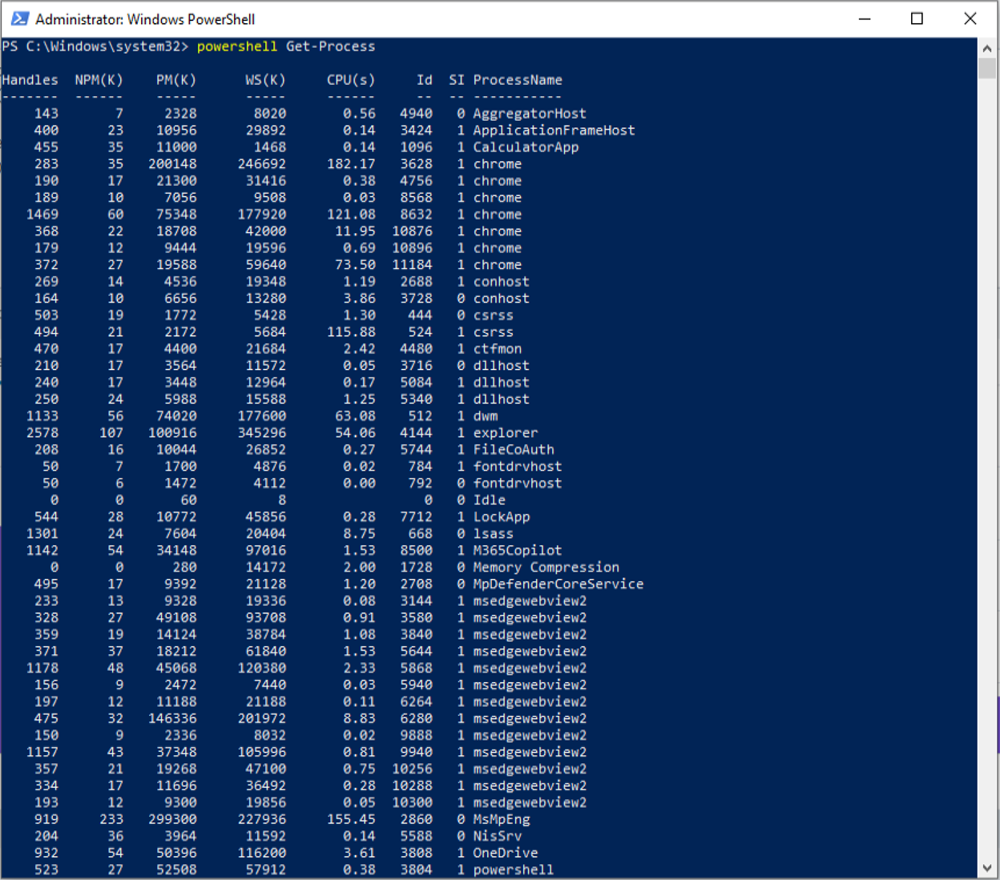

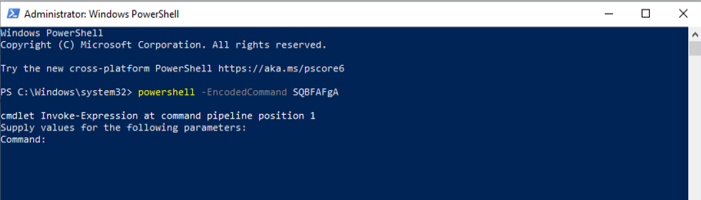

### Simulation 4 — Credential Access Attempt (LSASS)

**Purpose**

Simulate or detect processes attempting to access LSASS memory, commonly associated with credential dumping attacks.

**Threat Hunting Focus**

- Identify processes accessing lsass.exe  
- Detect abnormal process access behavior  

**Note**

Detection queries for this activity are included in the Threat Hunting Queries section.

## MITRE ATT&CK Mapping

- PowerShell Execution → T1059.001  
- Obfuscated Commands → T1027  
- Process Injection / Credential Access → T1003  

## Attack Scenario Summary

During the lab, multiple attack simulations were executed:

1. PowerShell encoded command execution
2. Suspicious process spawning (calc.exe via PowerShell)
3. SSH brute force attempts from attacker system

### Detection Flow

- Sysmon captured process execution
- Splunk queries identified suspicious command-line patterns
- Investigation workflow validated activity
- Fail2Ban automatically blocked attacking IP

This demonstrates a complete SOC workflow from detection to automated response.

------------------------------------------------------------------------


# 10. Hunting Queries Development

Threat hunting queries were developed using Splunk SPL to explore endpoint telemetry and identify suspicious behaviors.

Due to Sysmon logs being ingested in XML format, field extraction was required using regular expressions.

## Field Extraction

The following fields were extracted from raw Sysmon logs:

- Image (Process name)
- CommandLine (Executed command)
- ParentImage (Parent process)

### Field Extraction Query
```
index=* sourcetype="XmlWinEventLog:Microsoft-Windows-Sysmon/Operational"
| rex field=_raw "<Data Name='Image'>(?<Image>[^<]+)</Data>"
| rex field=_raw "<Data Name='CommandLine'>(?<CommandLine>[^<]+)</Data>"
| rex field=_raw "<Data Name='ParentImage'>(?<ParentImage>[^<]+)</Data>"
| head 20
```

## Hunting Approach

The queries were designed to:

- Identify frequently executed processes  
- Detect suspicious PowerShell activity  
- Analyze command-line arguments  
- Investigate parent-child relationships  

## Threat Hunting Advantage

Unlike static detection rules, these queries allow analysts to explore data dynamically and uncover hidden threats through behavioral analysis.

Proper field extraction significantly improves visibility and enables more effective threat hunting.

This approach simulates real-world SOC threat hunting scenarios where analysts must work with raw, unstructured logs and extract meaningful insights.

------------------------------------------------------------------------

# 11. Sigma Detection Rules

Sigma rules were used to represent detection logic in a standardized, platform-agnostic format.

Although this project focuses on threat hunting, Sigma rules were included to demonstrate how hunting findings can be converted into detection rules.

### Example Sigma Rule

```yaml
title: Suspicious PowerShell Encoded Command
logsource:
  product: windows
  service: sysmon

detection:
  selection:
    EventID: 1
    Image|endswith: '\powershell.exe'
    CommandLine|contains:
      - '-EncodedCommand'
      - '-enc'

condition: selection
level: high
```

**Stored in repository:**

sigma-rules/encoded_powershell.yml

## Purpose
- Convert hunting insights into detection logic
- Standardize detection across SIEM platforms
- Improve SOC detection coverage

------------------------------------------------------------------------


# 12. Alert Engineering

While the primary focus of this project is threat hunting, selected hunting queries were converted into alert rules to demonstrate SOC operationalization.

#### SOC Alert Example

**Alert Name:** Suspicious PowerShell Encoded Command

**Detection Query**
```
index=* sourcetype="XmlWinEventLog:Microsoft-Windows-Sysmon/Operational"
| rex field=_raw "<Data Name='Image'>(?<Image>[^<]+)</Data>"
| rex field=_raw "<Data Name='CommandLine'>(?<CommandLine>[^<]+)</Data>"
| search Image="*powershell.exe" AND CommandLine="*EncodedCommand*"
| stats count by host CommandLine
```

### Alert Logic

Trigger an alert when encoded PowerShell commands are observed, as they may indicate obfuscated or malicious execution.

### Schedule

Run every 5 minutes

### Severity

High

### SOC Response

1. Review the command-line execution details  
2. Identify the affected host and user context  
3. Analyze parent-child process relationships  
4. Check for persistence mechanisms or lateral movement  
5. Escalate if malicious activity is confirmed  

## Threat Hunting to Detection Transition

This demonstrates how proactive threat hunting findings can be transformed into production-ready alert rules within a SOC environment.

   
------------------------------------------------------------------------

# 13. Visualization

Splunk dashboards were used to support threat hunting activities by visualizing endpoint telemetry and identifying anomalies.

## Dashboard Purpose

- Monitor PowerShell activity  
- Identify unusual process execution patterns  
- Analyze command-line usage  
- Support investigation workflows  

## Example Panels

- Top executed processes  
- PowerShell command frequency  
- Process execution timeline  
- Parent-child process relationships  

## Threat Hunting Value

Visualization enables analysts to quickly identify anomalies, prioritize investigations, and gain insights into system behavior.

**Screenshot**


------------------------------------------------------------------------

# 14. Threat Detection Coverage Matrix

| Attack Technique | Detection Query | MITRE ATT&CK |
|-----------------|---------------|-------------|
| PowerShell Encoded Command | SPL Query | T1059.001 |
| Obfuscated Command Execution | SPL Query | T1027 |
| Suspicious Process Spawn | SPL Query | T1059 |
| LSASS Access | SPL Query | T1003 |


## Purpose

This matrix demonstrates detection coverage across key attacker techniques and highlights how threat hunting queries align with MITRE ATT&CK.

It provides visibility into detection capabilities and helps identify potential gaps in monitoring.

This matrix highlights how threat hunting findings were translated into detection logic, ensuring coverage of key adversary techniques within the lab environment.

-----------------------------------------------------------------

# 15. Threat Hunting Queries

This section demonstrates practical threat hunting queries developed using Splunk SPL to identify suspicious behaviors within endpoint telemetry.

Each query is aligned with a hypothesis and mapped to MITRE ATT&CK techniques.

---

## 15.1 Suspicious PowerShell Execution

**Objective**

Identify PowerShell usage across the environment to detect potential abuse.

**Splunk Query**

```
index=* sourcetype="XmlWinEventLog:Microsoft-Windows-Sysmon/Operational"
| rex field=_raw "<Data Name='Image'>(?<Image>[^<]+)</Data>"
| search Image="*powershell.exe"
| stats count by host Image

```

**MITRE ATT&CK**

T1059.001 — PowerShell

**Analysis**

PowerShell is commonly used by attackers for execution and post-exploitation.  
High frequency or unusual usage may indicate malicious activity.

**Screenshot**

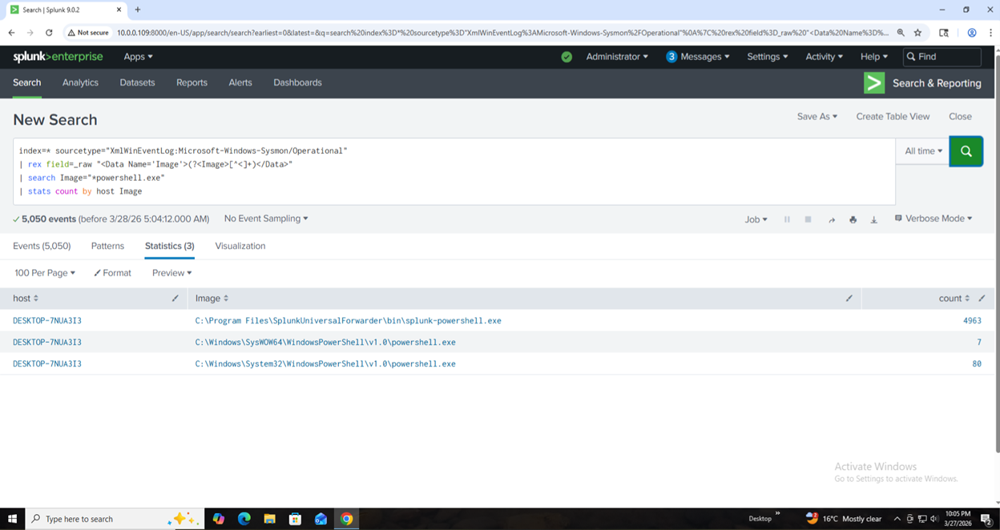

---

## 15.2 Encoded PowerShell Command Detection

**Objective**

Detect obfuscated PowerShell commands used to evade detection.

**Splunk Query**

```
index=* sourcetype="XmlWinEventLog:Microsoft-Windows-Sysmon/Operational"
| rex field=_raw "<Data Name='CommandLine'>(?<CommandLine>[^<]+)</Data>"
| search CommandLine="EncodedCommand"
| stats count by host CommandLine

```

**MITRE ATT&CK**

T1027 — Obfuscated Files or Information

**Analysis**

Encoded commands are often used to hide malicious payloads.  
This behavior is a strong indicator of suspicious activity.

**Screenshot**

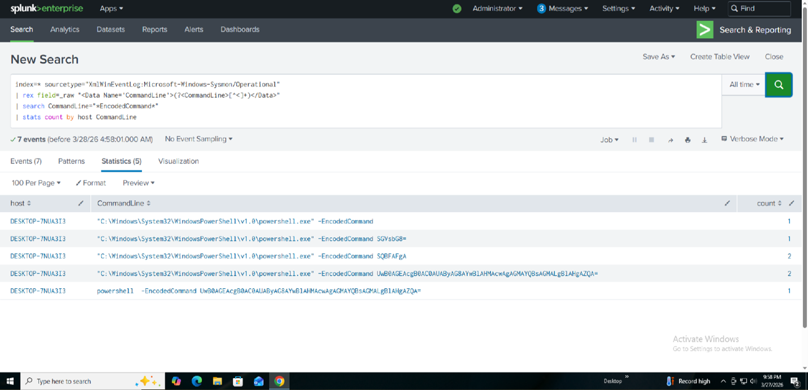

---

## 15.3 Suspicious Parent-Child Process Relationship

**Objective**

Identify abnormal process spawning behavior.

**Splunk Query**

```
index=* sourcetype="XmlWinEventLog:Microsoft-Windows-Sysmon/Operational"
| rex field=_raw "<Data Name='Image'>(?<Image>[^<]+)</Data>"
| rex field=_raw "<Data Name='ParentImage'>(?<ParentImage>[^<]+)</Data>"
| search ParentImage="*powershell.exe"
| stats count by ParentImage Image

```


**MITRE ATT&CK**

T1059 — Command and Scripting Interpreter

**Analysis**

PowerShell spawning unexpected processes (e.g., calc.exe) may indicate malicious execution or testing of payload delivery.

**Screenshot**

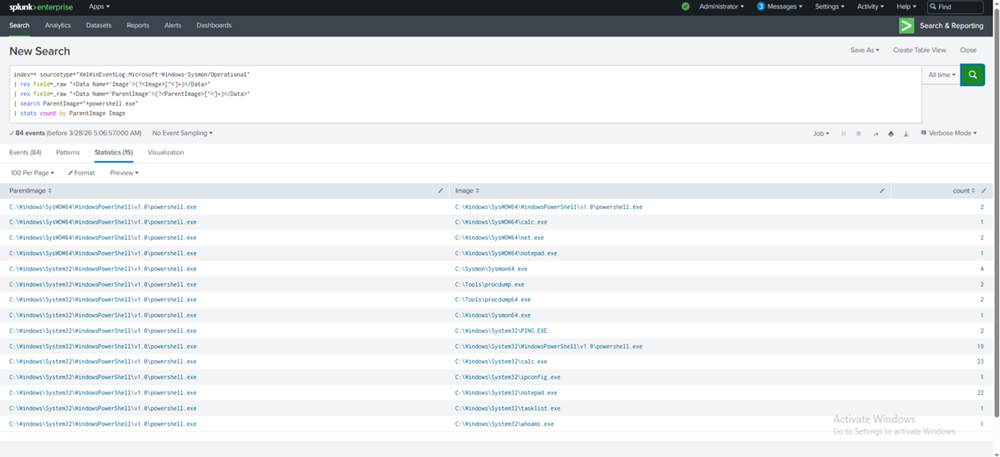

---

## 15.4 LSASS Access Detection (Credential Dumping)

**Objective**

Detect processes attempting to access LSASS memory.

**Splunk Query**

```
index=* EventCode=10
| rex field=_raw "<Data Name='TargetImage'>(?<TargetImage>[^<]+)</Data>"
| rex field=_raw "<Data Name='SourceImage'>(?<SourceImage>[^<]+)</Data>"
| search TargetImage="*lsass.exe"
| stats count by SourceImage TargetImage
```


**MITRE ATT&CK**

T1003 — Credential Dumping

**Analysis**

Access to LSASS is a strong indicator of credential dumping attempts.  

Any non-standard process accessing LSASS should be investigated immediately.

No results were observed during the lab execution, indicating that no processes attempted to access LSASS memory.

This is expected behavior in a controlled environment and demonstrates that the detection logic is correctly configured to identify credential access attempts when they occur.

**Screenshot**

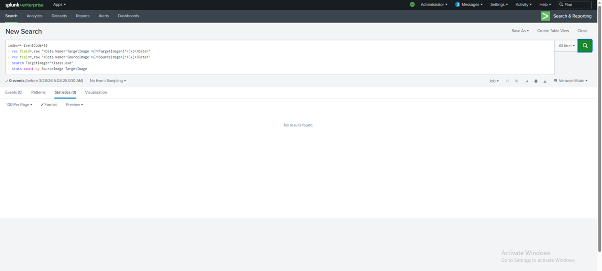

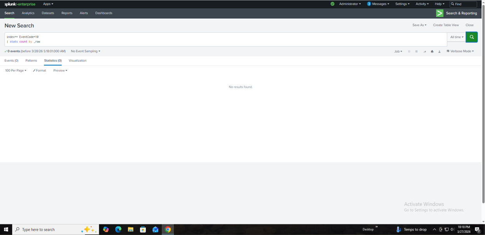

---

## 15.5 Process Enumeration Activity

**Objective**

Detect commands used for system discovery.

**Splunk Query**
```
index=* sourcetype="XmlWinEventLog:Microsoft-Windows-Sysmon/Operational"
| rex field=_raw "<Data Name='CommandLine'>(?<CommandLine>[^<]+)</Data>"
| search CommandLine="Get-Process"
| stats count by CommandLine
```

**MITRE ATT&CK**

T1057 — Process Discovery

**Analysis**

Attackers often enumerate running processes to identify targets for privilege escalation or injection.

**Screenshot**

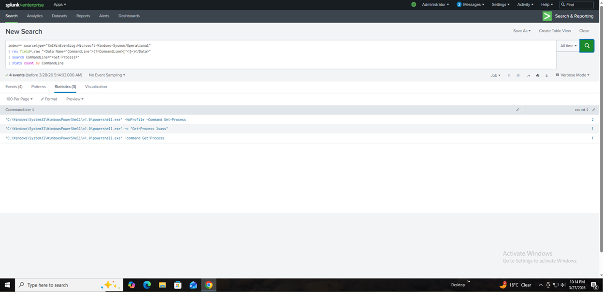

---

## Threat Hunting Outcome

The above queries demonstrate how raw telemetry can be analyzed to uncover suspicious behaviors without relying on predefined alerts.

This approach enables SOC analysts to:

- Detect stealthy attacker activity  
- Investigate anomalies proactively  
- Correlate behaviors across multiple data sources  
- Improve detection coverage  


------------------------------------------------------------------------


# 16. Investigation Workflow

This section outlines the step-by-step investigation process followed after detecting suspicious activity in the environment.

The workflow simulates how a Security Operations Center (SOC) analyst would triage and investigate alerts.

Raw Sysmon logs were inspected to validate command-line execution details and confirm detection accuracy.

This investigation workflow follows a structured SOC methodology: Detection → Triage → Analysis → Validation → Escalation → Response.

---

## Step 1 — Alert Trigger

Detection alerts are generated based on suspicious activity such as:

- PowerShell encoded commands
- Execution policy bypass
- LSASS access attempts

Example:

| Detection | Trigger |
|----------|--------|
| Encoded PowerShell | CommandLine contains "EncodedCommand" |
| Execution Policy Bypass | "ExecutionPolicy Bypass" |
| LSASS Access | TargetImage = lsass.exe |

---

## Step 2 — Initial Triage

Validate whether the alert is a false positive or requires investigation.

Key checks:

- Frequency of occurrence
- Host involved
- Time of execution
- User context (if available)

Splunk Query:

```spl
index=* sourcetype="XmlWinEventLog:Microsoft-Windows-Sysmon/Operational"
| rex field=_raw "<Data Name='Image'>(?<Image>[^<]+)</Data>"
| rex field=_raw "<Data Name='CommandLine'>(?<CommandLine>[^<]+)</Data>"
| rex field=_raw "<Data Name='ParentImage'>(?<ParentImage>[^<]+)</Data>"
| search CommandLine="*EncodedCommand*"
| table _time host Image ParentImage CommandLine
| sort -_time

```
**EncodedCommand detection results**

**Screenshot**


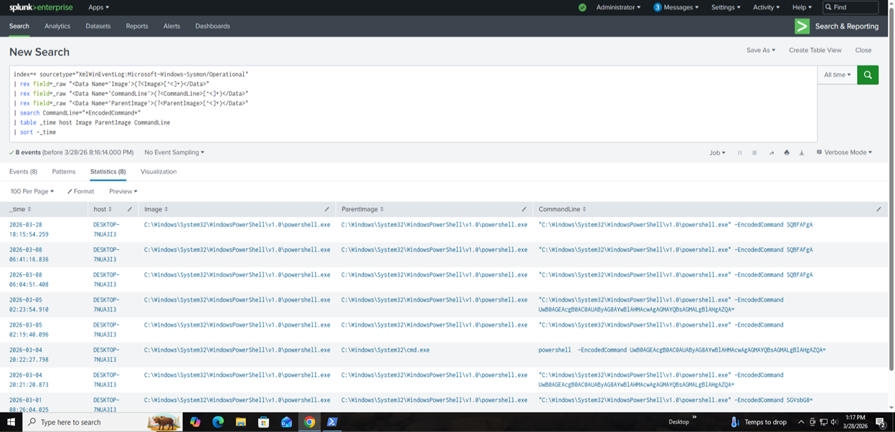

**Figure: Detection of encoded PowerShell execution during triage phase**

## Step 3 — Process Analysis

Understand process behavior and relationships.

Questions:

- What launched the process?
- Is the parent process legitimate?
- Is PowerShell spawned from unusual locations?

Example Query:
```
index=* sourcetype="XmlWinEventLog:Microsoft-Windows-Sysmon/Operational"
| rex field=_raw "<Data Name='Image'>(?<Image>[^<]+)</Data>"
| rex field=_raw "<Data Name='ParentImage'>(?<ParentImage>[^<]+)</Data>"
| rex field=_raw "<Data Name='CommandLine'>(?<CommandLine>[^<]+)</Data>"
| table _time Image ParentImage CommandLine
| sort -_time
```
**Process table view**

**Screenshot**

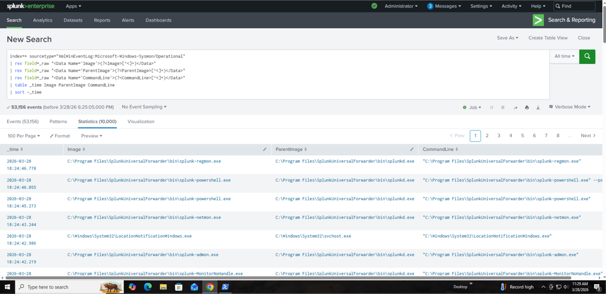

**Figure: Process analysis showing parent-child relationships and command-line execution using Sysmon telemetry**


## Step 4 — Parent-Child Relationship Analysis

Identify suspicious process chains.

Examples:

winword.exe → powershell.exe
explorer.exe → cmd.exe → powershell.exe

Query:

```
index=* sourcetype="XmlWinEventLog:Microsoft-Windows-Sysmon/Operational"
| rex field=_raw "<Data Name='Image'>(?<Image>[^<]+)</Data>"
| rex field=_raw "<Data Name='ParentImage'>(?<ParentImage>[^<]+)</Data>"
| where isnotnull(ParentImage)
| stats count by ParentImage Image
| sort -count
```

**Parent-child stats query**

**Screenshot**

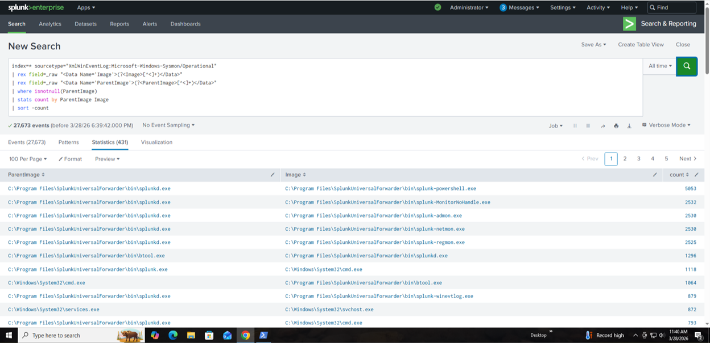

**Figure: Aggregated parent-child process relationships highlighting execution patterns**


**Figure: Process tree analysis showing parent-child relationships used to identify suspicious execution chains.**

## Step 5 — Command Line Inspection

Analyze command-line arguments for:

- Encoded commands
- Obfuscation
- Suspicious flags


Query:
```
index=* sourcetype="XmlWinEventLog:Microsoft-Windows-Sysmon/Operational"
| rex field=_raw "<Data Name='CommandLine'>(?<CommandLine>[^<]+)</Data>"
| search CommandLine="*EncodedCommand*"
| table _time host CommandLine
| sort -_time
```

**Screenshot**

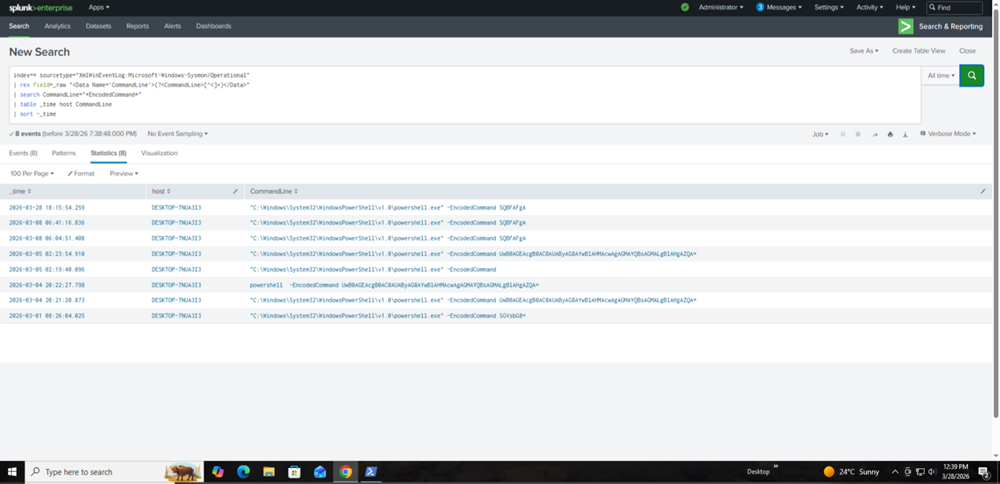

**Figure: Detection of encoded PowerShell command execution through command-line inspection**

The presence of "EncodedCommand" indicates potential obfuscation and is commonly associated with malicious PowerShell activity used in post-exploitation techniques.

Encoded commands are often Base64-encoded payloads used to evade detection and conceal malicious intent, making them a high-fidelity indicator during threat hunting.

## Step 6 — Timeline Analysis

Reconstruct attacker activity timeline.

This helps identify bursts of suspicious activity and correlate execution patterns over time.

Query:

```
index=* sourcetype="XmlWinEventLog:Microsoft-Windows-Sysmon/Operational"
| rex field=_raw "<Data Name='CommandLine'>(?<CommandLine>[^<]+)</Data>"
| search CommandLine="*EncodedCommand*"
| timechart count
```

```
index=* sourcetype="XmlWinEventLog:Microsoft-Windows-Sysmon/Operational"
| rex field=_raw "<Data Name='CommandLine'>(?<CommandLine>[^<]+)</Data>"
| search CommandLine="*EncodedCommand*"
| timechart span=1h count
```

**Timeline view**

**Screenshot**

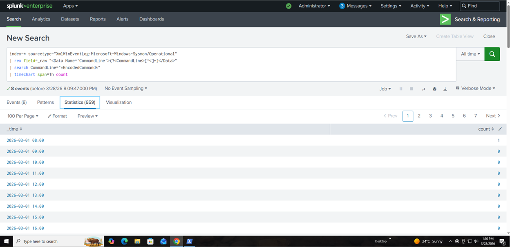

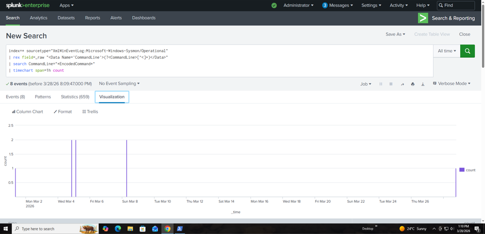

## Step 7 — Threat Validation

Additional validation includes checking whether the activity aligns with known attacker techniques mapped to MITRE ATT&CK (e.g., T1059 - Command and Scripting Interpreter).

The detected activity is validated by correlating:

- Process lineage (ParentImage → Image)
- Command-line arguments
- Frequency and timing of execution

This helps distinguish between:

- Legitimate administrative activity
- Suspicious but non-malicious behavior
- Confirmed malicious execution

## Step 8 — Escalation

If confirmed suspicious:

- Escalate to Tier 2 / Incident Response
- Preserve logs
- Document findings

## Step 9 — Documentation

Record:

- Detection triggered
- Queries used
- Findings
- Final verdict


## Step 10 — Response Recommendation

Based on the investigation outcome, recommended actions include:

- Terminate suspicious processes
- Isolate affected host from the network
- Block execution via endpoint protection controls
- Monitor for recurrence of similar behavior

----------------------------------------------------------------------------

# 17. Automated Defense (Fail2Ban)

To enhance defensive capabilities, automated response mechanisms were implemented using Fail2Ban.

Fail2Ban monitors log activity and automatically blocks suspicious behavior by updating firewall rules.

This demonstrates how detection can be operationalized into active defense.

This bridges the gap between detection engineering and automated incident response within a SOC environment.

---

## Objective

- Automatically respond to suspicious activity
- Reduce response time
- Simulate real-world SOC automation

---

## Use Case — SSH Brute Force Detection

Fail2Ban was configured on the Linux (Splunk) server to monitor authentication logs.

When multiple failed login attempts are detected:

- The source IP is automatically banned
- Firewall rules are updated dynamically

---

## Configuration File

Location:
```
/etc/fail2ban/jail.local
```
Example configuration:

```
[sshd]
enabled = true
port = ssh
filter = sshd
logpath = /var/log/auth.log
maxretry = 3
bantime = 600
findtime = 600
```


---

## Explanation

- maxretry → Number of failed attempts allowed
- bantime → Duration of ban (in seconds)
- findtime → Time window for failed attempts

---

## Verification

The following command was used to verify that the SSH protection mechanism was active and enforcing bans.

Check Fail2Ban status:

```
sudo fail2ban-client status sshd
```
Example output:

```
Status for the jail: sshd
|- Filter
|  |- Currently failed: 0
|  |- Total failed: 5
|  `- File list: /var/log/auth.log
`- Actions
   |- Currently banned: 1
   |- Total banned: 1
   `- Banned IP list: 192.168.1.100
```

---

## Screenshot

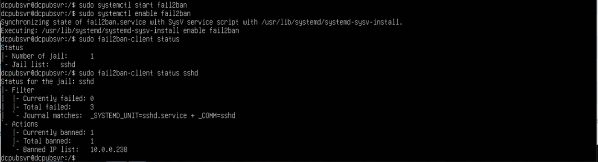

Figure: Fail2Ban automatically banning a source IP after multiple failed SSH login attempts, demonstrating real-time automated defense.

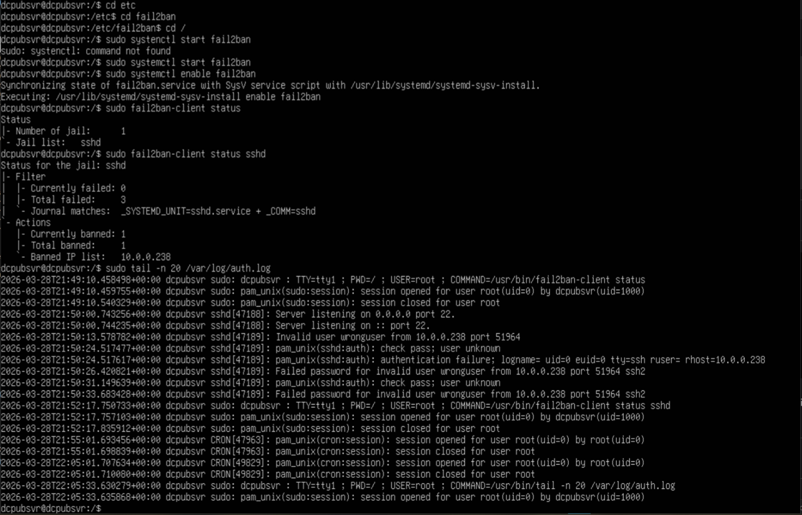

Figure: Multiple failed SSH login attempts detected in system logs prior to automated banning.

Fail2Ban detected multiple failed login attempts within a defined time window and triggered a ban after exceeding the configured threshold.

This demonstrates correlation between authentication logs and automated defensive actions, aligning with real-world SOC response workflows.

---

## Integration with SIEM

Fail2Ban logs and SSH activity are ingested into Splunk.

This enables:

- Visibility into blocked attacks
- Correlation with detection alerts
- Historical tracking of attacker behavior

Fail2Ban events can be correlated with Sysmon telemetry in Splunk to provide end-to-end visibility from detection to response.

---

## Security Impact

- Reduces manual intervention
- Blocks repeated attack attempts
- Demonstrates automated containment
- Reduces Mean Time to Response (MTTR) through automated containment

---

## SOC Relevance

This implementation simulates:

Detection → Alert → Automated Response

which is a key capability in modern SOC environments.

---

## Limitations

- Only reactive to known patterns
- Requires proper tuning to avoid false positives
- Limited to host-level defense

---

## Future Enhancements

- Integrate with SOAR platform
- Automated alert-to-response pipelines
- Expand to multiple services (HTTP, FTP, etc.)


------------------------------------------------------------------------

# 18. Troubleshooting

During the implementation of this lab, several technical challenges were encountered across log ingestion, detection queries, and system configuration.

This section documents the issues faced and the steps taken to resolve them, reflecting real-world SOC troubleshooting practices.

---

## Issue 1 — Sysmon Not Recognized in PowerShell

### Problem

The command

 ```
 sysmon -c sysmonconfig.xml
 ``` 
 
 failed with: "sysmon is not recognized as the name of a cmdlet"

### Root Cause

- Sysmon executable was not in the system PATH
- Command was executed from a different directory

### Resolution

- Navigated to the Sysmon installation directory
- Executed Sysmon using full path:

```
C:\Tools\Sysmon64.exe -c C:\Tools\sysmonconfig.xml

```

---

## Issue 2 — No Logs Appearing in Splunk

### Problem

Splunk queries returned no results for Sysmon logs.

### Root Cause

- Sysmon logs were not being forwarded
- Incorrect sourcetype or index configuration

### Resolution

- Verified Splunk Universal Forwarder configuration
- Confirmed log source:

```
WinEventLog:Microsoft-Windows-Sysmon/Operational
```

- Restarted Splunk services

---

## Issue 3 — Fields Not Extracted (Image, CommandLine, ParentImage)

### Problem

Fields such as Image and CommandLine were not visible in Splunk.

### Root Cause

- Sysmon logs stored in XML format
- Fields not automatically parsed

### Resolution

- Used rex extraction:

```
| rex field=_raw "<Data Name='Image'>(?<Image>[^<]+)</Data>"
```


- Applied consistent extraction across all queries

---

## Issue 4 — Splunk Query Returning No Results

### Problem

Detection queries returned zero results.

### Root Cause

- Incorrect filtering
- Events not generated during testing

### Resolution

- Generated test activity manually:
  - PowerShell execution
  - Encoded commands
- Validated using broader queries before narrowing filters

---

## Issue 5 — Fail2Ban Not Installed

### Problem

Command `fail2ban-client` not found.

### Root Cause

- Fail2Ban package not installed on Ubuntu

### Resolution

```
sudo apt update
sudo apt install fail2ban -y
```

---
## Issue 6 — SSH Attack Not Detected

### Problem

Fail2Ban did not trigger bans.

### Root Cause

- Incorrect IP targeting
- Network connectivity issues between VMs

### Resolution

- Identified correct Ubuntu IP using:

```
ip a
```

- Verified connectivity
- Generated multiple failed SSH login attempts

---
## Issue 7 — Incorrect Command Usage

### Problem

Command failed due to syntax error:

```
cd..
```

### Root Cause

- Missing space in Linux command

### Resolution

```
cd ..
```

---
## Issue 8 — Service Command Typo

### Problem
```
systemctl: command not found
```

### Root Cause

- Typo in command (`systemct1` instead of `systemctl`)

### Resolution

Corrected command:
```
sudo systemctl start fail2ban
```

---
## Issue 9 — EncodedCommand Not Detected Initially

### Problem

Search queries for "EncodedCommand" returned no results.

### Root Cause

- CommandLine field was not extracted
- Raw XML logs were not parsed

### Resolution

- Applied rex extraction for CommandLine
- Verified presence of encoded PowerShell execution

---
## Issue 10 — LSASS Detection Query Returned No Results

### Problem

LSASS access detection query returned no results.

### Root Cause

- No LSASS-related events were generated during testing
- Incorrect event filtering

### Resolution

- Generated relevant activity
- Validated query logic using broader searches

---

## Issue 11 — Time Range Causing No Results in Splunk

### Problem

Splunk queries returned no results even though logs were present.

### Root Cause

- Incorrect time range selection in Splunk search
- Events existed outside the selected window

### Resolution

- Adjusted time range to "All Time"
- Validated data availability using broader queries

---

## Key Takeaways

- Log validation is critical before building detections
- Field extraction (rex) is essential for working with raw XML logs
- Proper time range selection is crucial in Splunk investigations
- Network configuration directly impacts attack simulation
- Small syntax errors can cause significant failures
- Troubleshooting and root cause analysis are core SOC skills

These troubleshooting scenarios reflect real-world challenges faced by SOC analysts and demonstrate practical problem-solving skills in security operations environments.

------------------------------------------------------------------------

# 19. SOC Metrics

This section defines key Security Operations Center (SOC) metrics used to evaluate detection effectiveness, response efficiency, and overall security posture.

These metrics simulate how real-world SOC teams measure performance and continuously improve detection capabilities.

---

## Objective

- Measure detection effectiveness
- Track response performance
- Identify gaps in monitoring
- Improve overall SOC maturity

---

## Key Metrics Implemented

### 1. Detection Volume

Measures the volume of detection events over time.

**Purpose:**

- Identify spikes in suspicious activity
- Detect abnormal behavior patterns

**Splunk Query:**
```
index=* sourcetype="XmlWinEventLog:Microsoft-Windows-Sysmon/Operational"
| timechart span=1h count by host
```


**Screenshot**

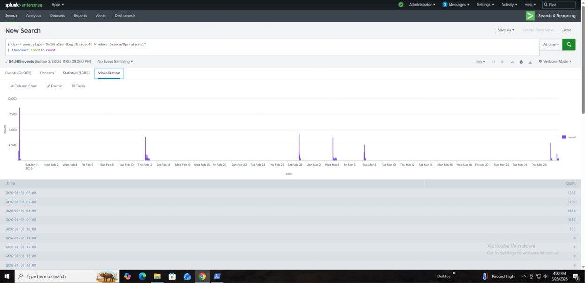

**Figure: Time-based visualization of detection events across the environment**

---

### 2. Top Triggered Detections

Identifies the most frequently triggered detection rules.

**Purpose:**

- Highlight common attack techniques
- Identify noisy detections

**Splunk Query:**

```
index=* sourcetype="XmlWinEventLog:Microsoft-Windows-Sysmon/Operational"
| rex field=_raw "<Data Name='CommandLine'>(?<CommandLine>[^<]+)</Data>"
| eval DetectionType=case(
like(CommandLine,"%EncodedCommand%"),"Encoded PowerShell",
like(CommandLine,"%ExecutionPolicy Bypass%"),"Execution Policy Bypass"
)
| where isnotnull(DetectionType)
| stats count by DetectionType
| sort -count
```


**Screenshot**

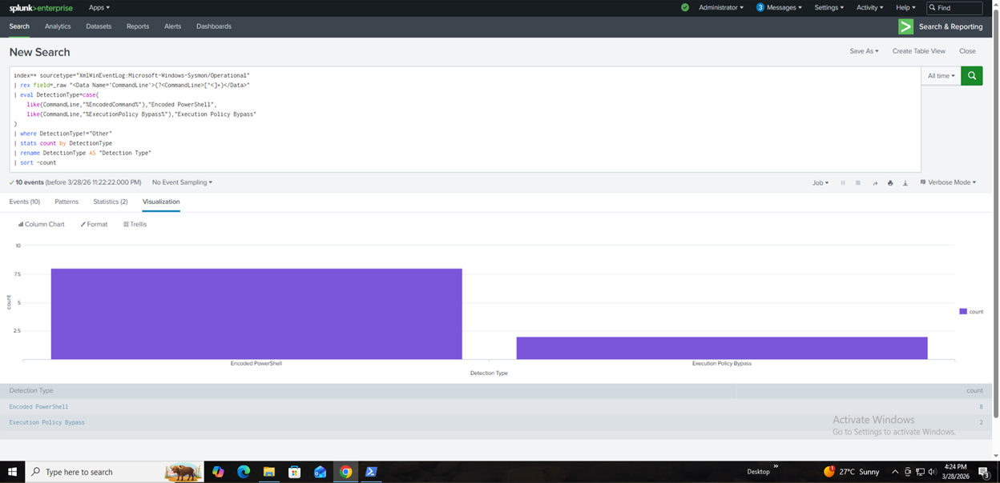

**Figure: Distribution of detection types based on command-line patterns**

---

### 3. Suspicious Process Frequency

Tracks frequently executed suspicious processes.

**Purpose:**

- Identify repeated attacker behavior
- Detect persistence or automation

**Splunk Query:**
```
index=* sourcetype="XmlWinEventLog:Microsoft-Windows-Sysmon/Operational"
| rex field=_raw "<Data Name='Image'>(?<Image>[^<]+)</Data>"
| stats count by Image
| sort -count
```

**Screenshot**


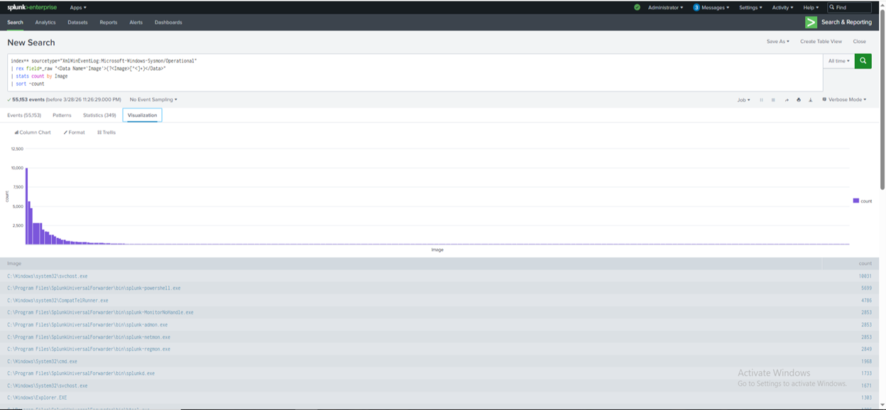

**Figure: Frequency of executed processes observed in the environment**

---

### 4. Parent-Child Process Anomalies

Analyzes unusual process relationships.

**Purpose:**

- Detect suspicious execution chains
- Identify lateral movement or scripting activity

**Splunk Query:**
```
index=* sourcetype="XmlWinEventLog:Microsoft-Windows-Sysmon/Operational"
| rex field=_raw "<Data Name='Image'>(?<Image>[^<]+)</Data>"
| rex field=_raw "<Data Name='ParentImage'>(?<ParentImage>[^<]+)</Data>"
| stats count by ParentImage Image
| sort -count
```

**Screenshot**

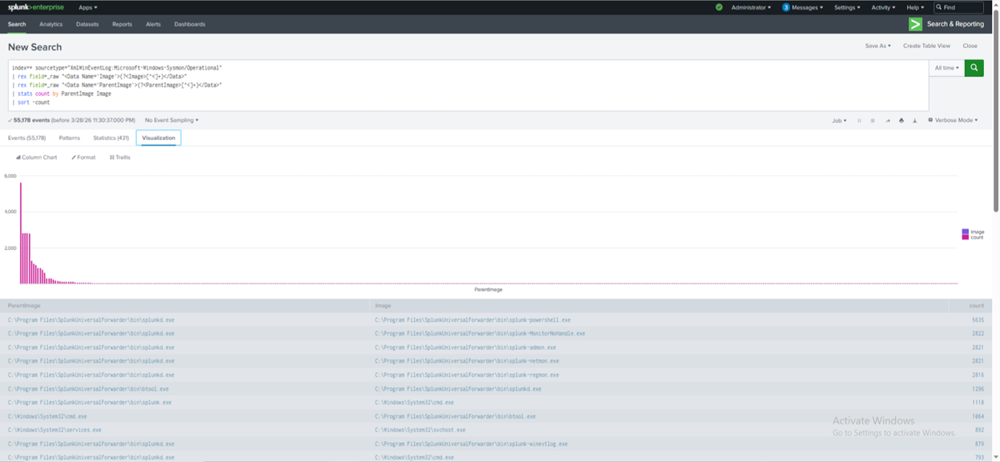

**Figure: Parent-child process relationships highlighting execution chains**

---

### 5. Failed Authentication Attempts (Fail2Ban Correlation)

Tracks failed SSH login attempts and banned IPs.

**Purpose:**

- Measure brute force attempts
- Validate automated defense effectiveness

**Splunk Query:**
```
index=* "Failed password"
| rex field=_raw "from\s(?<src_ip>\d{1,3}(\.\d{1,3}){3})"
| where src_ip!="127.0.0.1"
| stats count by src_ip
| sort -count
```


**Screenshot**

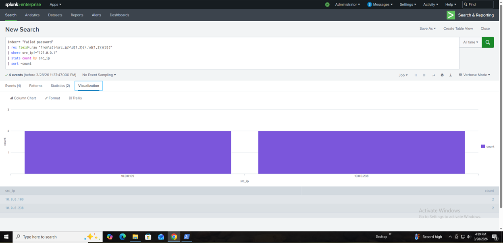

**Figure: Failed SSH login attempts grouped by source IP**

---

### 6. Mean Time to Detect (MTTD) – Simulated

Represents time taken to detect suspicious activity.

**Approach:**

- Compare event time vs detection time

**Note:**

Due to lab limitations, MTTD is estimated based on query execution time and alert visibility.

---

### 7. Mean Time to Respond (MTTR) – Simulated

Represents time taken to respond to detected threats.

**Approach:**

- Measure time between detection and action (e.g., Fail2Ban ban)

**Example:**

- Detection: Failed login attempts
- Response: IP banned within defined threshold

---

## SOC Performance Insights

These metrics align with MITRE ATT&CK techniques such as T1059 (Command Execution) and T1110 (Brute Force), strengthening detection coverage validation.

- Detection coverage includes execution, credential access, and brute force attempts
- Automated response reduces manual intervention
- Repeated patterns indicate realistic attack simulation
- Metrics support continuous improvement of detection logic

---

## SOC Maturity Mapping

| Capability | Status |
|----------|--------|
| Log Collection | Implemented |
| Detection Engineering | Implemented |
| Alerting | Implemented |
| Investigation | Implemented |
| Automated Response | Implemented |
| Metrics & Monitoring | Implemented |

---

## Conclusion

SOC metrics provide visibility into detection performance and operational efficiency.

This implementation demonstrates how security monitoring evolves from simple detection to measurable and optimized defense operations.

These metrics demonstrate a transition from reactive monitoring to proactive, metrics-driven security operations.


------------------------------------------------------------------------

# 20. Lessons Learned

This project provided hands-on experience in building, validating, and operationalizing security detections within a SOC environment.

It highlighted the importance of not only detecting threats but also understanding system behavior, troubleshooting issues, and measuring detection effectiveness.

---

## 1. Importance of Log Visibility

- Detection is only as effective as the visibility of logs
- Ensuring proper log collection and forwarding is critical before building detections
- Missing or misconfigured logs can lead to blind spots in security monitoring

---

## 2. Field Extraction is Essential

- Raw Sysmon logs are in XML format and require parsing
- Using `rex` for field extraction is necessary for meaningful analysis
- Without proper extraction, detection queries will fail or produce inaccurate results

---

## 3. Noise Reduction Improves Detection Quality

- Not all events are relevant for detection
- Filtering noise (e.g., localhost traffic, benign processes) significantly improves signal quality
- Clean data leads to more accurate and actionable detections

---

## 4. Detection Requires Real Data

- Queries may return no results if no events are generated
- Simulating activity (PowerShell, SSH attacks) is necessary to validate detections
- Detection engineering must be tested against realistic scenarios

---

## 5. Correlation Across Systems is Powerful

- Combining Windows (Sysmon) and Linux (auth logs, Fail2Ban) provides better visibility
- Multi-source correlation enables stronger detection and response capabilities
- Real SOC environments rely on cross-platform telemetry

---

## 6. Automation Enhances Response

- Fail2Ban demonstrated how detection can trigger automated actions
- Automated response reduces manual effort and improves response time
- This reflects real-world SOC automation practices

---

## 7. Troubleshooting is a Core SOC Skill

- Issues such as missing logs, incorrect queries, and misconfigurations are common
- Identifying root causes and resolving them is a critical skill for analysts
- Practical troubleshooting experience is as important as detection logic

---

## 8. Metrics Drive Continuous Improvement

- SOC metrics such as detection volume, frequency, and response time provide measurable insights
- Metrics help identify gaps and improve detection strategies
- Security operations should be data-driven, not assumption-based

---

## 9. Time Range and Data Validation Matter

- Incorrect time selection in Splunk can lead to false assumptions of no activity
- Always validate data availability before refining queries
- Proper validation ensures accurate investigation outcomes

---

## 10. End-to-End SOC Workflow Understanding

This project helped build a complete understanding of the SOC lifecycle:

Detection → Investigation → Response → Metrics

- Detection identifies suspicious activity
- Investigation validates and analyzes events
- Response mitigates threats
- Metrics improve future detection capabilities

---

## Conclusion

This project strengthened practical skills in detection engineering, log analysis, and SOC operations.

It also demonstrated the importance of combining technical knowledge with analytical thinking to effectively detect and respond to real-world cyber threats.

------------------------------------------------------------------------

# 21. Skills Demonstrated

This project demonstrates a wide range of practical cybersecurity and SOC-related skills across detection engineering, log analysis, and incident response.

---

## 1. SIEM & Log Analysis

- Hands-on experience with Splunk for log ingestion, search, and analysis
- Ability to work with Windows Event Logs and Linux authentication logs
- Experience analyzing large volumes of security telemetry

---

## 2. Detection Engineering

- Developed detection queries for:
  - PowerShell encoded commands
  - Execution policy bypass
  - LSASS access attempts
  - SSH brute force attacks
- Translated threat behaviors into detection logic
- Reduced false positives through filtering and tuning

---

## 3. Splunk Querying (SPL)

- Strong use of SPL commands:
  - `search`, `stats`, `timechart`, `sort`
  - `rex` for field extraction from raw XML logs
  - `eval` and `case` for detection categorization
- Built structured and optimized queries for threat hunting

---

## 4. Threat Hunting

- Proactively searched for suspicious behavior in logs
- Identified abnormal patterns in:
  - Command-line activity
  - Process execution
  - Parent-child relationships
- Applied hypothesis-driven investigation techniques

---

## 5. Incident Investigation

- Performed step-by-step investigation workflow:
  - Alert triage
  - Process analysis
  - Command-line inspection
  - Timeline reconstruction
- Differentiated between benign and suspicious activity

---

## 6. Endpoint Monitoring (Sysmon)

- Configured Sysmon for enhanced Windows telemetry
- Analyzed Sysmon Event IDs for:
  - Process creation
  - Command-line activity
  - Process access (LSASS)
- Worked with custom Sysmon configuration

---

## 7. Linux Security Monitoring

- Analyzed SSH authentication logs
- Detected brute force attempts
- Integrated Linux logs into SIEM

---

## 8. Security Automation

- Implemented Fail2Ban for automated threat response
- Configured rules for SSH brute force detection
- Demonstrated automated blocking of malicious IPs

---

## 9. SOC Operations Workflow

- Simulated real SOC lifecycle:
  - Detection → Investigation → Response → Metrics
- Understood Tier 1 / Tier 2 SOC responsibilities
- Documented findings and response actions

---

## 10. MITRE ATT&CK Mapping

- Mapped detections to MITRE ATT&CK techniques:
  - T1059 — Command Execution
  - T1003 — Credential Dumping
  - T1110 — Brute Force
- Demonstrated understanding of adversary behavior

---

## 11. Data Visualization & Reporting

- Created SOC dashboards and visual metrics in Splunk
- Used charts to represent detection trends and attack patterns
- Presented findings in a structured and professional format

---

## 12. Troubleshooting & Debugging

- Resolved issues related to:
  - Log ingestion failures
  - Field extraction challenges
  - Query errors and no-result scenarios
  - Network connectivity issues
- Applied systematic troubleshooting approach

---

## 13. Cybersecurity Concepts

- Understanding of:
  - SIEM architecture
  - Log pipelines
  - Detection vs prevention
  - Attack simulation and validation
- Applied practical security monitoring techniques

---

## Conclusion

This project demonstrates end-to-end SOC capabilities, combining technical skills, analytical thinking, and real-world problem-solving required for cybersecurity analyst and detection engineering roles.

------------------------------------------------------------------------
## My Role

- Designed and built the entire lab environment
- Configured Sysmon and Splunk ingestion pipeline
- Developed detection queries using SPL
- Conducted threat hunting and investigations
- Implemented automated response using Fail2Ban
- Created dashboards and SOC metrics

------------------------------------------------------------------------

## Future Improvements

Possible enhancements to this SOC lab include:

• Integrating threat intelligence feeds\
• Automating detection using SOAR workflows\
• Adding ransomware detection scenarios\
• Implementing Active Directory attack simulations\
• Expanding Sigma rule coverage\
• Add additional detection rules\
• Integrate alert automation\
• Expand dashboard visualization\
• Simulate additional attack techniques

These improvements would further enhance the detection and response capabilities of the lab environment.
