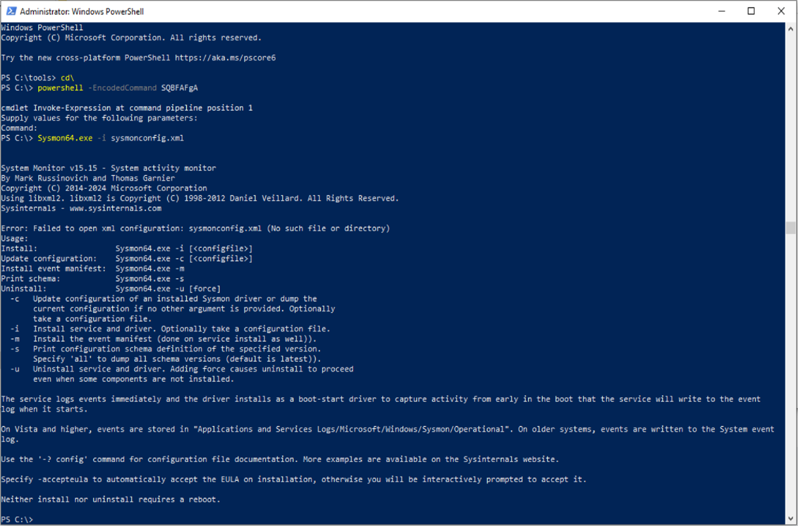
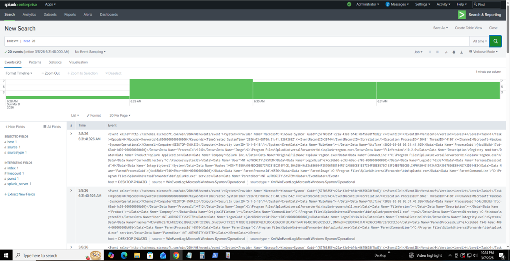
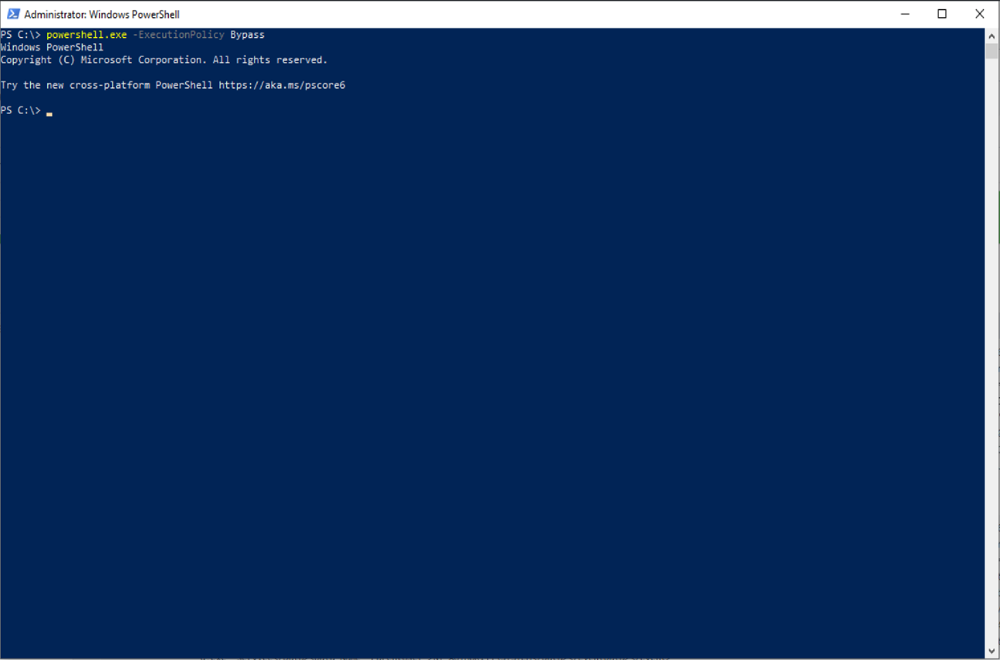
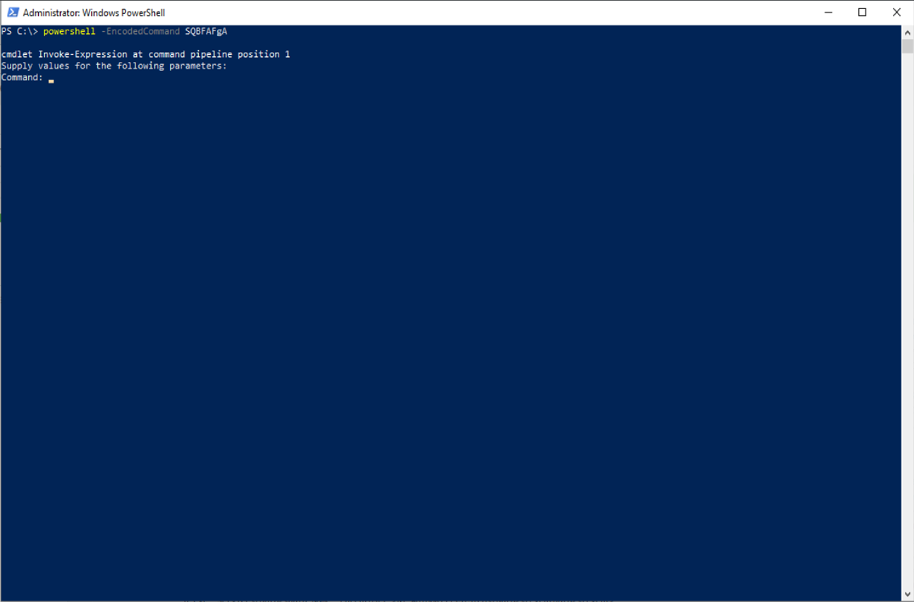
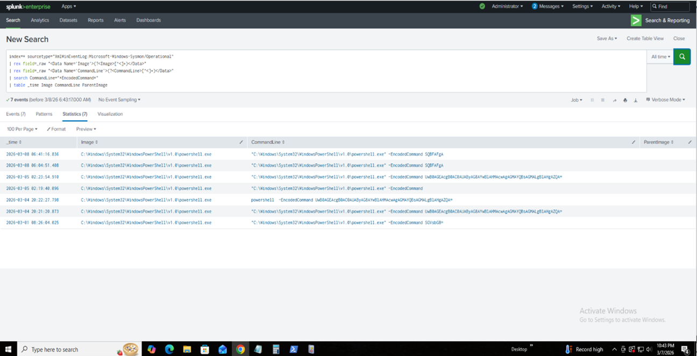

# SOC Threat Detection Lab: Detecting PowerShell Attacks using Sysmon + Splunk

Author: Deepak Pawar\
Project Type: Blue Team / SOC Detection Engineering Lab

------------------------------------------------------------------------

# 1. Executive Summary

This project demonstrates how a Security Operations Center (SOC) detects
malicious activity on Windows endpoints using **Sysmon telemetry and
Splunk SIEM**.

The lab simulates common attacker behaviors such as:

-   PowerShell Execution Policy Bypass
-   Encoded PowerShell commands
-   LSASS process access attempts

Telemetry generated by these activities is captured using **Sysmon**,
forwarded using **Splunk Universal Forwarder**, and analyzed in **Splunk
Enterprise** using detection queries.

This project demonstrates a **complete SOC detection pipeline** used in
real-world environments.

------------------------------------------------------------------------

# 2. Project Overview

Goal:

Build a realistic SOC lab that simulates attacker techniques and detects
them using Splunk.

Capabilities demonstrated:

• Endpoint telemetry collection\
• SIEM ingestion\
• Threat simulation\
• Detection engineering\
• Alert creation\
• MITRE ATT&CK mapping\
• Investigation workflow

------------------------------------------------------------------------

# 3. Lab Architecture

Screenshot to add:

images/lab_architecture.png

Recommended diagram:

Attacker Simulation\
↓\
Windows Endpoint (Sysmon)\
↓\
Splunk Universal Forwarder\
↓\
Splunk Enterprise SIEM

------------------------------------------------------------------------

# 4. Telemetry Sources

Primary telemetry collected:

Windows Event Logs\
Sysmon Event Logs\
PowerShell Execution Logs\
Process Creation Events\
Network Connection Events

Important Sysmon Event IDs:

1 -- Process Creation\
3 -- Network Connection\
7 -- Image Load\
11 -- File Creation\
13 -- Registry Modification

------------------------------------------------------------------------

# 5. Tools & Environment

  Tool                         Purpose
  ---------------------------- --------------------
  Splunk Enterprise            SIEM platform
  Sysmon                       Endpoint telemetry
  Splunk Universal Forwarder   Log forwarding
  Windows 10 VM                Target endpoint
  PowerShell                   Attack simulation
  Kali Linux / Parrot Linux    Attacker machine

------------------------------------------------------------------------

# 6. Folder Structure

    SOC-Detection-Lab/
    │
    ├── README.md
    ├── architecture/
    │   └── lab_architecture.png
    ├── screenshots/
    │   ├── sysmon_install.png
    │   ├── splunk_data_ingestion.png
    │   ├── powershell_attack.png
    │   ├── encoded_command_detection.png
    │   └── dashboard.png
    ├── detections/
    │   └── spl_queries.md
    ├── sigma_rules/
    │   └── powershell_encoded_command.yml

------------------------------------------------------------------------

# 7. Environment Setup

## Install Splunk

Download from:

https://www.splunk.com

Install Splunk Enterprise and start service.

------------------------------------------------------------------------

## Install Sysmon

Download Sysmon:

https://learn.microsoft.com/sysinternals/downloads/sysmon

Install using:

    Sysmon64.exe -i sysmonconfig.xml

Screenshot to add:

------------------------------------------------------------------------

# 8. Log Collection Pipeline

Pipeline used in this project:

Endpoint → Sysmon → Windows Event Log → Universal Forwarder → Splunk →
Detection Queries

Screenshot to add:

------------------------------------------------------------------------

# 9. Detection Strategy

Detection strategy focuses on identifying suspicious PowerShell
activity.

Indicators monitored:

ExecutionPolicy Bypass\
EncodedCommand usage\
Suspicious parent processes

------------------------------------------------------------------------

# 10. Attack Simulations

Attack simulations used:

## LSASS Enumeration

    powershell -c "Get-Process lsass"

Screenshot to add:

screenshots/lsass_attack.png

------------------------------------------------------------------------

## PowerShell Execution Policy Bypass

    powershell.exe -ExecutionPolicy Bypass

Screenshot to add:

------------------------------------------------------------------------

## Encoded PowerShell Command

    powershell -EncodedCommand SQBFAFgA

Screenshot to add:

------------------------------------------------------------------------

# 11. Detection Engineering

Splunk detection query:

    index=* sourcetype="XmlWinEventLog:Microsoft-Windows-Sysmon/Operational"
    | rex field=_raw "<Data Name='Image'>(?<Image>[^<]+)</Data>"
    | rex field=_raw "<Data Name='CommandLine'>(?<CommandLine>[^<]+)</Data>"
    | search CommandLine="*EncodedCommand*"
    | table _time Image CommandLine ParentImage
    | sort -_time

Screenshot to add:

------------------------------------------------------------------------

# 12. Sigma Detection Rules

Example Sigma rule:

    title: Suspicious PowerShell Encoded Command
    logsource:
      product: windows
      service: sysmon

    detection:
      selection:
        CommandLine|contains:
          - EncodedCommand

    condition: selection
    level: high

------------------------------------------------------------------------

# 13. Alert Engineering

Alert Name:

Suspicious PowerShell Encoded Command

Trigger:

CommandLine contains "EncodedCommand"

Severity:

High

------------------------------------------------------------------------

# 14. Visualization

SOC dashboards created in Splunk showing:

PowerShell activity\
Top processes\
Suspicious commands

Screenshot to add:

screenshots/dashboard.png

------------------------------------------------------------------------

# 15. MITRE ATT&CK Mapping

  Technique   Description
  ----------- --------------------
  T1059.001   PowerShell
  T1003       Credential Dumping
  T1057       Process Discovery

------------------------------------------------------------------------

# 16. Investigation Workflow

SOC analyst workflow:

Alert triggered\
↓\
Review command line\
↓\
Identify suspicious process\
↓\
Correlate parent process\
↓\
Investigate host activity

------------------------------------------------------------------------

# 17. Automated Defense (Fail2Ban)

Optional automated defense layer:

Fail2Ban monitors logs and blocks suspicious IPs after repeated attack
patterns.

------------------------------------------------------------------------

# 18. Troubleshooting

Common issues:

No logs in Splunk\
→ Check Universal Forwarder

Sysmon not logging\
→ Verify configuration file

Fields missing in Splunk\
→ Use rex extraction

------------------------------------------------------------------------

# 19. SOC Metrics

Metrics monitored:

Mean Time To Detect (MTTD)\
Mean Time To Respond (MTTR)\
False Positive Rate

------------------------------------------------------------------------

# 20. Lessons Learned

Key lessons from the project:

Importance of endpoint telemetry\
PowerShell monitoring is critical\
SIEM detection engineering is essential for SOC operations

------------------------------------------------------------------------

# 21. Skills Demonstrated

Cybersecurity skills demonstrated:

Threat detection engineering\
Splunk SIEM analysis\
Endpoint telemetry collection\
MITRE ATT&CK mapping\
SOC investigation workflow

------------------------------------------------------------------------

# Conclusion

This SOC lab demonstrates how blue team defenders detect attacker
techniques using endpoint telemetry and SIEM analysis.

The project replicates real SOC operations including attack simulation,
log ingestion, detection engineering, and threat investigation.
